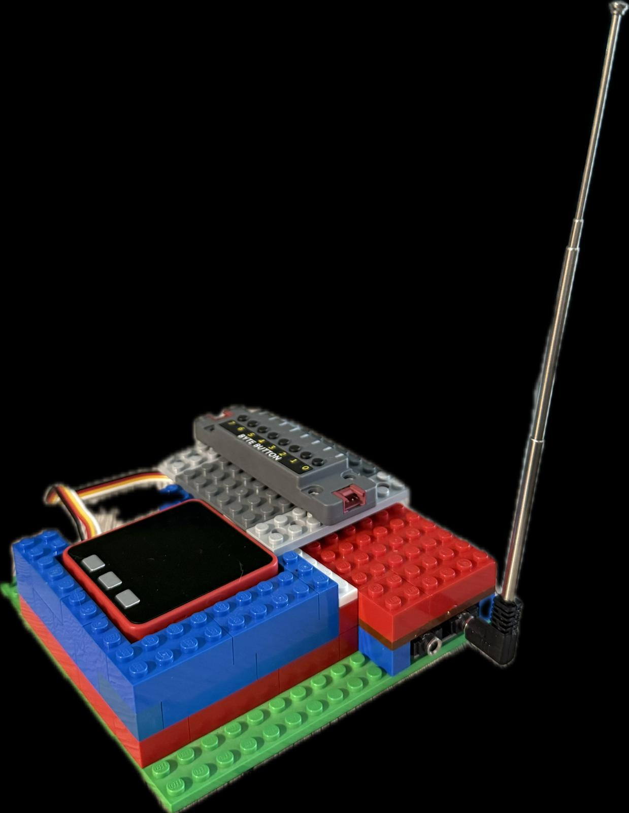

# Projecte Radio FM Educatiu amb M5Stack i TEA5767

## Descripció general

Aquest projecte és una iniciativa educativa per a treballar conceptes matemàtics (especialment nombres decimals) i competències STEAM mitjançant la construcció i programació d’una ràdio FM. Utilitzem una placa M5Stack Fire amb diversos mòduls (TEA5767 FM, botons, potenciòmetres) per controlar i explorar les freqüències de ràdio, tant de manera manual com amb un escaneig automàtic.

És un projecte curricular adreçat a alumnes de 1r i 2n d’ESO, que integra programació, electrònica, matemàtiques i pensament computacional en un entorn pràctic i motivador.

---

## Components principals

- Mòdul FM TEA5767 (freqüències 76-108 MHz)
- M5Stack Fire (controladora ESP32)
- PaHUB M5Stack per gestionar connexions
- Botonera ByteButton per a la interacció
- Potenciòmetre analògic per ajustar freqüències
- Sortida d’àudio per auriculars o altaveu amb amplificador

---

## Característiques del projecte

- Exploració de freqüències FM amb precisió decimal.
- Modes manual i d’escaneig automàtic per trobar emissores.
- Emmagatzematge local de les freqüències detectades.
- Interfície visual a la pantalla M5Stack.
- Enfocament competencial i interdisciplinari (STEAM i matemàtiques).

---

## Aspectes educatius i curriculars

Aquest projecte permet treballar de forma concreta i aplicada:

- Comprensió i manipulació de nombres decimals (freqüències amb un decimal).
- Arrodoniment, ordenació i càlcul amb decimals.
- Programació i lògica per controlar dispositius i sensors.
- Coneixements bàsics d’electrònica i funcionament de ràdio FM.
- Desenvolupament de competències digitals i de pensament computacional.
- Treball col·laboratiu i aprenentatge per projectes.

---

## Organització dels fitxers i carpetes

/5. Radio FM/
│
├── blocks/ # Blocs i scripts de programació (m5b2, py)
│ ├── Blocs personalitzats/
│ ├── Radio autoscan/
│ ├── Radio manual/
│ └── Radio autoscan+manual/
│
├── Educational Resources/ # Recursos pedagògics i fitxes educatives (docx, pdf)
│
├── images/ # Fotografies i imatges del projecte i components
│
└── README.md # Aquest fitxer amb la documentació general

---

## Fotos del projecte

---

## Referències

- [Mòdul TEA5767 FM a Amazon](https://www.amazon.es/dp/B0CW4XG7JM?ref=ppx_yo2ov_dt_b_fed_asin_title)
- Components M5Stack oficials (paHUB, Fire, ByteButton)

---

## Contacte

Per a dubtes o col·laboracions: neusmstack@gmail.com

---

# Educational FM Radio Project with M5Stack and TEA5767

## Overview

This is an educational project aimed at exploring decimal numbers and STEAM competencies through building and programming an FM radio. Using an M5Stack Fire controller with modules like the TEA5767 FM radio, buttons, and potentiometers, students can manually tune or autoscan FM frequencies.

It’s designed for 1st and 2nd year secondary education students, blending programming, electronics, math, and computational thinking in a hands-on, motivating environment.

---

## Main components

- TEA5767 FM radio module (76-108 MHz range)
- M5Stack Fire (ESP32 controller)
- M5Stack PaHUB for connection management
- ByteButton keypad for interaction
- Analog potentiometer for tuning
- Audio output for headphones or amplified speaker

---

## Project features

- Precise decimal frequency control.
- Manual and automatic scanning modes.
- Local frequency memory storage.
- Visual interface on M5Stack display.
- Interdisciplinary STEAM and math focus.

---

## Educational & curriculum relevance

Students develop skills in:

- Understanding and working with decimal numbers (FM frequencies with one decimal).
- Rounding, ordering, and calculations with decimals.
- Programming logic and device control.
- Basic electronics and FM radio principles.
- Digital literacy and computational thinking.
- Collaborative, project-based learning.

---

## File & folder structure

/5. Radio FM/
│
├── blocks/
│ ├── Custom Blocks/
│ ├── Radio autoscan/
│ ├── Radio manual/
│ └── Radio autoscan+manual/
│
├── Educational Resources/
│
├── images/
│
└── README.md

---

## Project photos

---

## References

- [TEA5767 FM Module on Amazon](https://www.amazon.es/dp/B0CW4XG7JM?ref=ppx_yo2ov_dt_b_fed_asin_title)
- Official M5Stack components (paHUB, Fire, ByteButton)

---

## Contact

For questions or collaborations: neusmstack@gmail.com

---

# Proyecto Educativo de Radio FM con M5Stack y TEA5767

## Descripción general

Este proyecto es una iniciativa educativa para trabajar conceptos matemáticos (especialmente números decimales) y competencias STEAM mediante la construcción y programación de una radio FM. Usamos una placa M5Stack Fire con varios módulos (TEA5767 FM, botones, potenciómetros) para controlar y explorar las frecuencias de radio, tanto de manera manual como con un escaneo automático.

Es un proyecto curricular dirigido a alumnos de 1º y 2º de ESO, que integra programación, electrónica, matemáticas y pensamiento computacional en un entorno práctico y motivador.

---

## Componentes principales

- Módulo FM TEA5767 (frecuencias 76-108 MHz)
- M5Stack Fire (controladora ESP32)
- PaHUB M5Stack para gestionar conexiones
- Botonera ByteButton para la interacción
- Potenciómetro analógico para ajustar frecuencias
- Salida de audio para auriculares o altavoz con amplificador

---

## Características del proyecto

- Exploración de frecuencias FM con precisión decimal.
- Modos manual y de escaneo automático para encontrar emisoras.
- Almacenamiento local de las frecuencias detectadas.
- Interfaz visual en la pantalla M5Stack.
- Enfoque competencial e interdisciplinar (STEAM y matemáticas).

---

## Aspectos educativos y curriculares

Este proyecto permite trabajar de forma concreta y aplicada:

- Comprensión y manipulación de números decimales (frecuencias con un decimal).
- Redondeo, ordenación y cálculo con decimales.
- Programación y lógica para controlar dispositivos y sensores.
- Conocimientos básicos de electrónica y funcionamiento de radio FM.
- Desarrollo de competencias digitales y de pensamiento computacional.
- Trabajo colaborativo y aprendizaje por proyectos.

---

## Organización de archivos y carpetas

/5. Radio FM/
│
├── blocks/ # Bloques y scripts de programación (m5b2, py)
│ ├── Bloques personalizados/
│ ├── Radio autoscan/
│ ├── Radio manual/
│ └── Radio autoscan+manual/
│
├── Educational Resources/ # Recursos pedagógicos y fichas educativas (docx, pdf)
│
├── images/ # Fotografías e imágenes del proyecto y componentes
│
└── README.md # Este archivo con la documentación general

---

## Fotos del proyecto

---

## Referencias

- [Módulo TEA5767 FM en Amazon](https://www.amazon.es/dp/B0CW4XG7JM?ref=ppx_yo2ov_dt_b_fed_asin_title)
- Componentes oficiales M5Stack (paHUB, Fire, ByteButton)

---

## Contacto

Para dudas o colaboraciones: neusmstack@gmail.com

License / Llicència / Licencia
This project is licensed under the Creative Commons Attribution-ShareAlike 4.0 International License (CC BY-SA 4.0). You are free to share and adapt the material as long as you give appropriate credit and distribute your contributions under the same license.

Aquest projecte està llicenciat sota la llicència Creative Commons Atribució-CompartirIgual 4.0 Internacional (CC BY-SA 4.0). Es permet compartir i adaptar el material sempre que es reconegui l'autor i es distribueixi sota la mateixa llicència.

Este proyecto está licenciado bajo la licencia Creative Commons Atribución-CompartirIgual 4.0 Internacional (CC BY-SA 4.0). Se permite compartir y adaptar el material siempre que se reconozca la autoría y se distribuya bajo la misma licencia.

Fitxer LICENSE.md
markdown
Copia
# Creative Commons Attribution-ShareAlike 4.0 International License (CC BY-SA 4.0)

You are free to:

- **Share** — copy and redistribute the material in any medium or format
- **Adapt** — remix, transform, and build upon the material for any purpose, even commercially.

Under the following terms:

- **Attribution** — You must give appropriate credit, provide a link to the license, and indicate if changes were made. You may do so in any reasonable manner, but not in any way that suggests the licensor endorses you or your use.
- **ShareAlike** — If you remix, transform, or build upon the material, you must distribute your contributions under the same license as the original.

No additional restrictions — You may not apply legal terms or technological measures that legally restrict others from doing anything the license permits.

---

## Llicència Creative Commons Atribució-CompartirIgual 4.0 Internacional (CC BY-SA 4.0)

Ets lliure de:

- **Compartir** — copiar i redistribuir el material en qualsevol mitjà o format
- **Adaptar** — barrejar, transformar i crear a partir del material per qualsevol propòsit, fins i tot comercialment.

Sota les següents condicions:

- **Atribució** — Has de donar crèdit adequat, proporcionar un enllaç a la llicència i indicar si s’han fet canvis. Pots fer-ho de qualsevol manera raonable, però no de manera que suggereixi que el llicenciador t’avala a tu o a l’ús que en facis.
- **CompartirIgual** — Si remixes, transformes o crees a partir del material, has de distribuir les teves contribucions sota la mateixa llicència que l’original.

Sense restriccions addicionals — No pots aplicar termes legals o mesures tecnològiques que restringeixin legalment als altres de fer qualsevol cosa que permeti aquesta llicència.

---

## Licencia Creative Commons Atribución-CompartirIgual 4.0 Internacional (CC BY-SA 4.0)

Eres libre de:

- **Compartir** — copiar y redistribuir el material en cualquier medio o formato
- **Adaptar** — mezclar, transformar y crear a partir del material para cualquier propósito, incluso comercialmente.

Bajo los siguientes términos:

- **Atribución** — Debes otorgar el crédito adecuado, proporcionar un enlace a la licencia e indicar si se hicieron cambios. Puedes hacerlo de cualquier manera razonable, pero no de manera que sugiera que el licenciante te respalda a ti o a tu uso.
- **CompartirIgual** — Si remezclas, transformas o creas a partir del material, debes distribuir tus contribuciones bajo la misma licencia que el original.

Sin restricciones adicionales — No puedes aplicar términos legales o medidas tecnológicas que restrinjan legalmente a otros de hacer cualquier cosa que la licencia permita.
